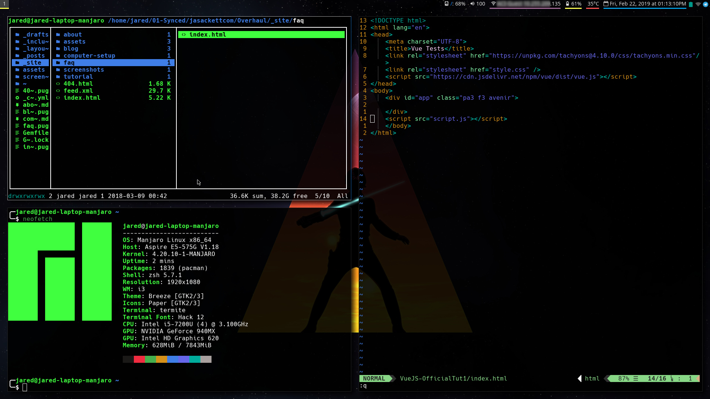
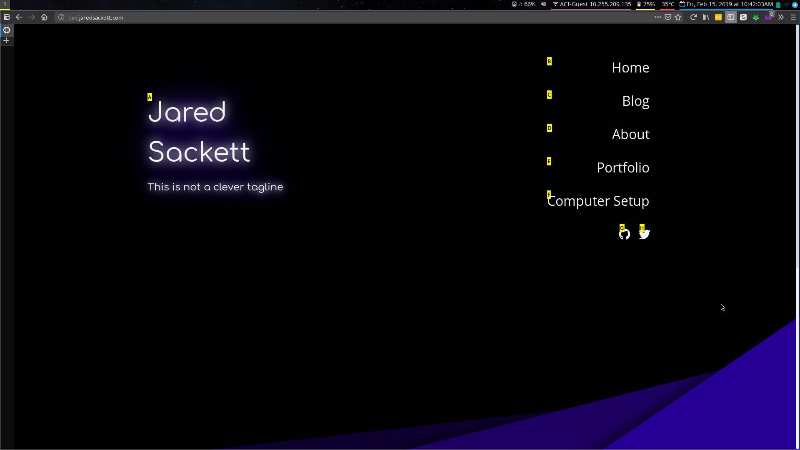

This is an overview of my computer setup. Enjoy, and feel free to comment or ask questions!

## Specs
===
### Software

|    |    |
|  :-----          |  :-----          |
|  **OS:** |  Arch Linux on Desktop, Manjaro on Laptop |
|  **DE/WM** |  i3-gaps |
|  **Browser** |  Firefox, with a few modifications |
|  **Terminal** |  Termite |
|  **Shell** |  zsh (oh-my-zsh) |
|  **File Manager** | ranger |
|  **Messaging app**  | Telegram  |
|  **Text editor**  |  Neovim  |
|  **Status bar**  |  Polybar  |
|  **Syncing tool**  |  Syncthing  |

*Dotfiles on my github*

### Hardware - Desktop
_I've since heavily changed my desktop hardware, but haven't yet updated this, so it's a bit out of date._
[UserBenchmark link](https://www.userbenchmark.com/UserRun/3274789)

|    |    |
|  :-----          |  :-----          |
| __Processor__ | AMD FX6100 (Hex Core) |
| __GPU__ | Nvidia GeForce GTX 1070 |
| __RAM__ | 16GB DDR3 |
| __SDD__ | 256GB Crucial |
| __HDD__ | 1TB Seagate |

### Hardware - Laptop
*UserBenchmark Link Coming Soon&trade;*

|    |    |
|  :-----          |  :-----          |
| __Model__ | Acer E5-575G-53VG |
| __Processor__ | Intel i5 6200U |
| __RAM__ | 8GB DDR4 |
| __SSD__ | 240GB |
| __HDD__ | 1TB |
| __GPU__ | Nvidia 940Mx |

## Keyboard Layout
* * *
The weirdest thing about my setup is that I use the [Colemak keyboard layout](https://colemak.com/). This changes about half of the key positions, but learning it was definitely worth it (took about 2 months). I can type very quickly and more importantly, I can type comforatably. Just watching people type on QWERTY hurts my fingers now.The main downside is that if I'm using a PC with QWERTY I'm down to about 30WPM instead of my usual 80-90WPM that I do on Colemak (The fastest I've gotten is about 100WPM in a typing test). 

A lot of people use [Dvorak](https://www.dvorak-keyboard.com/) instead of QWERTY, but I chose Colemak instead for a few reasons:

* It's a little faster, since common key combos (such as "ie", "io", "ei", etc.) are next to each other allowing my hand to just roll into them.

* Dvorak hurt my pinky with the letter L being where the { is. Ouch.

* Colemak keeps a lot of the common key combos (Ctrl + Z,X,C,V,B) in the same spot, so I don't have to relearn those.

* ~~I want to make my life more difficult~~

The main downside with the alternative layout for me (other than lack of speed on QWERTY) was that the HJKL vim keybindings were less intuitive for me to learn: K (Up) is QWERTY's N, which is below L (Down), QWERTY's U. I just thought of it like one would think of an inverted flight controller if that makes sense.

Also, I have Caps Lock remapped to Esc for use with VIM-like stuff. Most people remap it to backspace, but ~~I don't make mistakes when typing~~ backspace is easier to reach than escape on most keyboards for me.

## General Usage
* * *

On both my desktop I use the [i3-gaps tiling window manager](https://github.com/Airblader/i3). I've switched to a tiling WM for simplicity, performance, and biggest of all: Speed. I use i3-gaps instead of i3 because gaps.

I can operate my computers close to the speed of thought&trade; via keyboard, limited only by myself (in regards to knowing exactly what I want to do and being able to type fast and accurate enough to do it) and my computer's speed. I have my most used applications bound to specific bindings, and I have a binding that brings up the rofi application search for any other apps. Rofi runs using drun instead of just run, so it searches .desktop files (basically shortcuts) for easier running of apps.

I have i3 set up with both arrow keys and vim keybindings, so I rarely have to leave the home-row. The specific application bindings are also mapped to macro keys on my Desktop's keyboard (Micro$oft Sidewinder X6) within easy reach of my left pinky, so I can quickly launch those.

My file browser of choice is the terminal-based "Ranger", which uses vim keybindings and can let me do things SUPER fast, like batch-renaming files, navigating between locations using both custom shortcuts and temporary markers, etc.

## Firefox Setup
* * *
I use [Vim Vixen](https://github.com/ueokande/vim-vixen), which is an addon that allows you to use VIM keybindings in Firefox, and has another great feature as well: Clicking links using the keyboard WITHOUT tabbing through them all. How does this work you ask?

When I press "f" on they keyboard, the plugin takes all visible links and assigns them letter combinations (usually just 2 letters) which it then displays in small yellow boxes over the links. All I have to do is look at the link I want to click, press "f", and then the letters in the box that appears over it, and it goes to that page. If I press Shift while typing the letters it opens the link in a new tab. I can browse the internet easily with just the keyboard, which means I can do it faster (most of the time, sometimes using a mouse is faster).

I've also modified a few of the Firefox config files and used the Tree Tab addon in order to move tabs from the top to the side. [See this for more information until I write a post about it](https://gitlab.com/t60r/dotfiles/wikis/home#firefox-setup)

## Syncthing
* * *

I use a program called [Syncthing](https://syncthing.net/) to sync files between my phone, laptop, and desktop instead of something cloud-based like Dropbox or Google Drive, mainly because of both unlimited storage and peer-to-peer transfers. My upload speed sucks (less than 1Mbps), so dropbox always took forever, and the space was limited. Additionally, Syncthing lets you choose folders to sync moreso than Dropbox, which for me has been really useful.

I have a general synced folder in my home directory called "01-Synced" (It's called this so it's at the top of the list) where I keep various projects and this website on, a folder for wallpapers called "02-DesktopWallpapers" (ditto), and a folder for my dotfiles (just called "dotfiles"). I replace the default dotfiles with a source command that pulls from that folder, and then overwrite anything that's system-specific.

## Desktops
* * *

By far one of the most useless, but most entertaining things I've set up is my Desktop switcher. In Ranger, I have a custom keybinding (s,b,g) that runs a script to set my background to whatever image I have selected. I often change my backgrounds, and when I have favorites I put a 00- at the beginning of the filename so they show up at the top of folders.

I also have a keybinding that selects a random background in whatever Ranger folder I'm in, and does the same thing. It also prints the filename and filepath to a file, so I can easily find it again (It's necessary when you have just under 800 wallpapers in various folders).

## Conclusion 
* * *

My setup was HEAVILY inspired by Luke Smith's [YouTube videos](https://www.youtube.com/channel/UC2eYFnH61tmytImy1mTYvhA) and [website](https://lukesmith.xyz). If you're reading this, thanks for sharing all your tips and knowlegde!

Hopefully this overview of how my computers are setup is useful and/or interesting to you! Be sure to ask any questions in the comments, as I might add to this post OR write a blog post about a feature if it needs more detail. Thanks for reading!